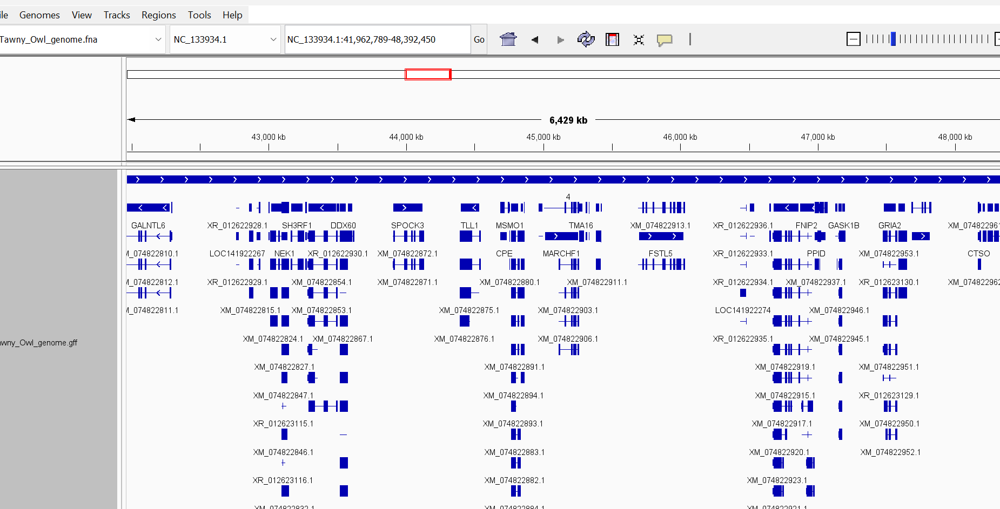
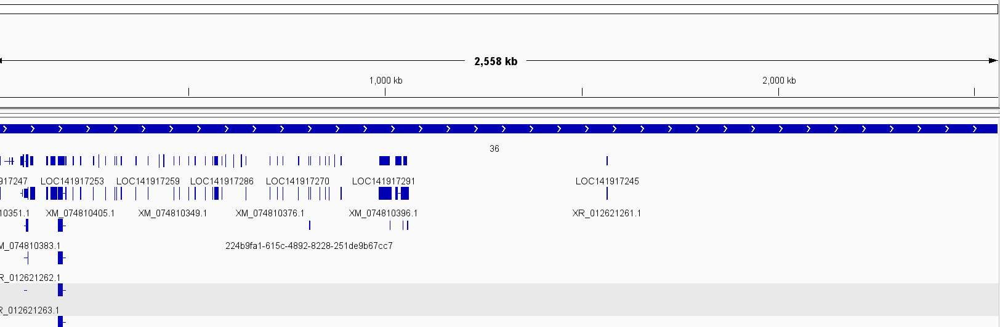
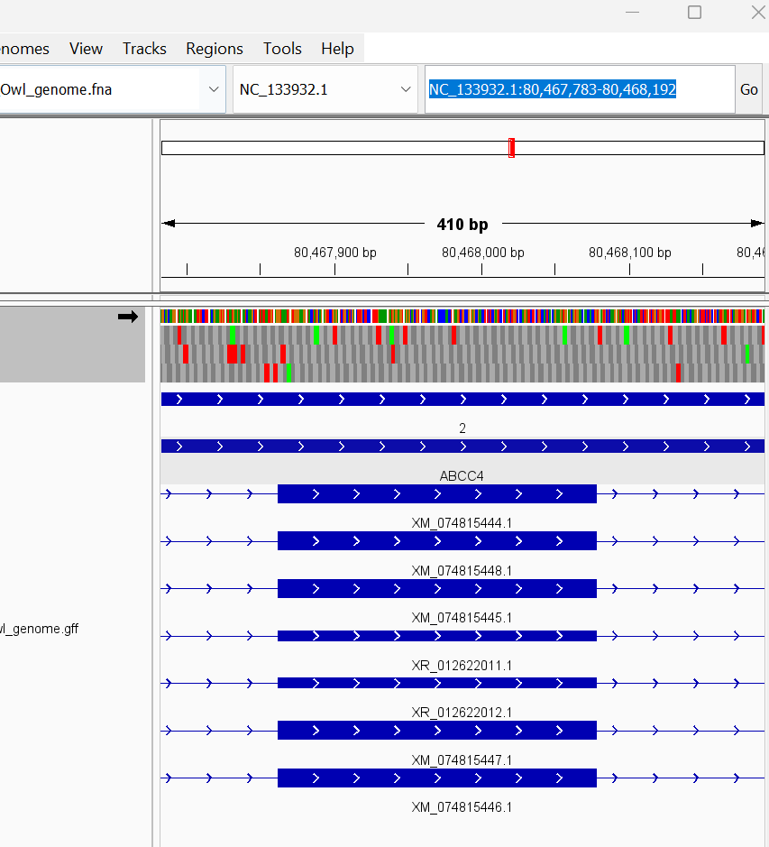
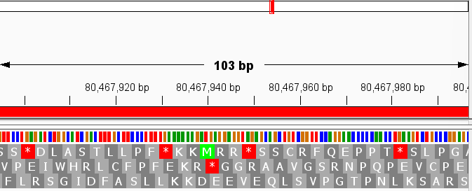
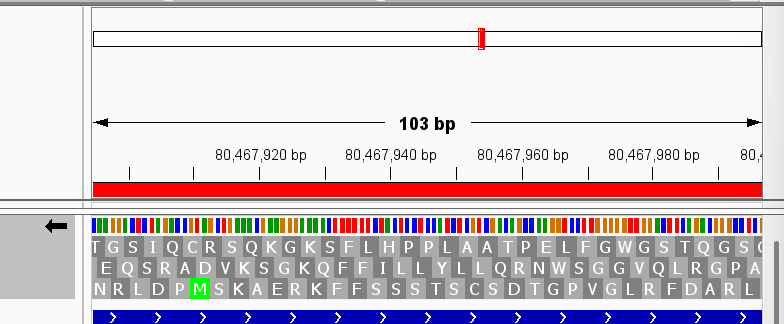
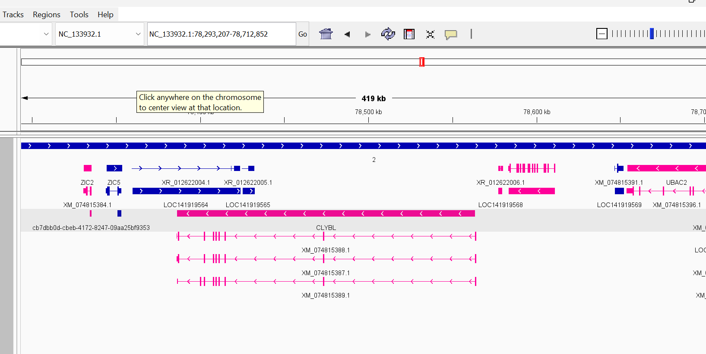

# Assignment 2

I am choosing to do the first project, where I will be downloading genomic data. 

I am choosing the Tawny Owl Genome "bStrAlu1.hap1" from NCBI. (NCBI RefSeq assembly
GCF_031877795.1)

[NCBI Genome](https://www.ncbi.nlm.nih.gov/datasets/genome/GCF_031877795.1/)

## Genome Information
This genome: 
-  is *1.4* gb long
-  has *39* somatic chromosomes 
-  has *3* sex chromosomes W, Z, MT
- contains *19,516* genes

It was sequenced in 2023 by the Vertebrate Genomes Project.

The genome seems pretty well annotated and a detailed build. Many of the inital projects I looked at did not contain chromosomal information and were just scaffold, while this one does and had a quality analysis of 98% on the NCBI website. 

### Genome browsing 
Q1. Genes (although many putative) are spaced every 50-300kb, which doesn't seem that unusual for a mammal and isn't that far off from human spacing. I did notice some very large gaps that were close to 1,000kb, though I'm not sure if this could be a result of incomplete annotation. 



However, there were chromosomes (e.g. 36) that had large segments that were non-coding. 



Q2. I selected NC_133932.1:80,467,783-80,468,192 on chromosome 2. (The one thing I do not appreciate about this genome is the confusing chromosome names)

Within this 410 bp region, there was in exon for the gene ABCC4 coding in the positive direction. Additionally, the same intron was annotated as several other unidentified genes starting with XM or XR. 



Q3. 
As you can see in the image, the intron could code 
- SS*DLASTlL...
- VPEIWHRLCF....
- FLRSGIDFASL
in the foward direction, depending on the starting codon reading frame 
or 
- TGSIQCSQK...
- EQSRADVKSG... 
- NRLDPMSKAEK... 
in the reverse direction 




Q4. The only type of data I can see on this browser is the annotation track, which shows exons and introns. This makes sense, since I used a GFF file and there shouldn't be any quantitative data. 

Q6. I made my reverse-coding genes a lovely pink. 



## Reproducing the workflow

Run these commands from this ```week02``` directory.

### Required software

- GNU Make
- NCBI Datasets CLI (`datasets`)
- `samtools`, `bgzip`, and `tabix` for indexing
- IGV for genome browsing


### Download files

```
make download-genome
```

This downloads the genome, GFF3, and GTF data for the default NCBI accession.
The Makefile places the results in:

- ```FASTA/Tawny_Owl_genome.fna```
- ```GFF/Tawny_Owl_genome.gff```
- ```GTF/Tawny_Owl_genome.gtf```


### Create indexes

```
make igv-index
```

This creates a FASTA index at ```FASTA/Tawny_Owl_genome.fna.fai```,
compresses the GFF as `GFF/Tawny_Owl_genome.gff.gz`.


### Browse in IGV

Load the FASTA as the genome reference and load the compressed GFF as an
annotation track. Navigate to
`NC_133932.1:80,467,783-80,468,192` to reproduce the coordinate inspection.


### Remove generated files

```
make clean
```

This permanently removes the entire `FASTA`, `GFF`, and `GTF` directories and
all files inside them. Do not use it if those directories contain files you
want to keep.

