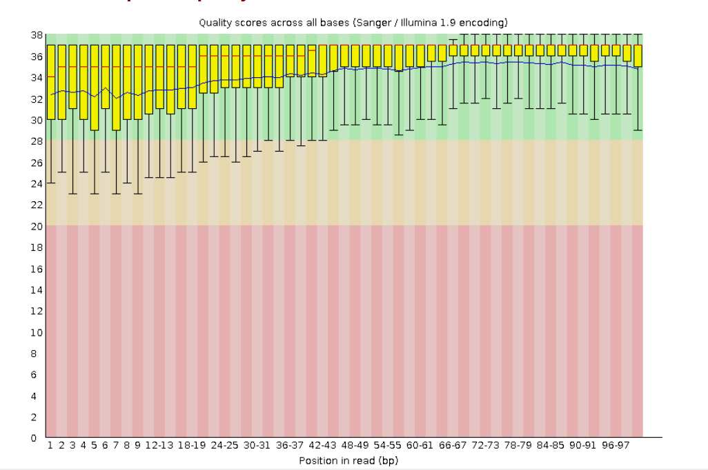
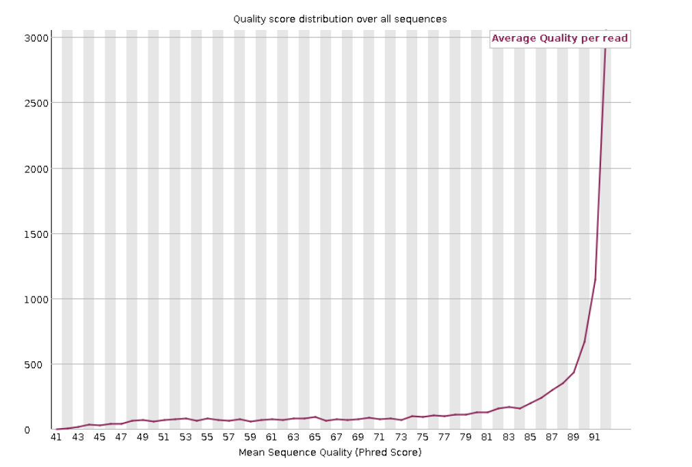
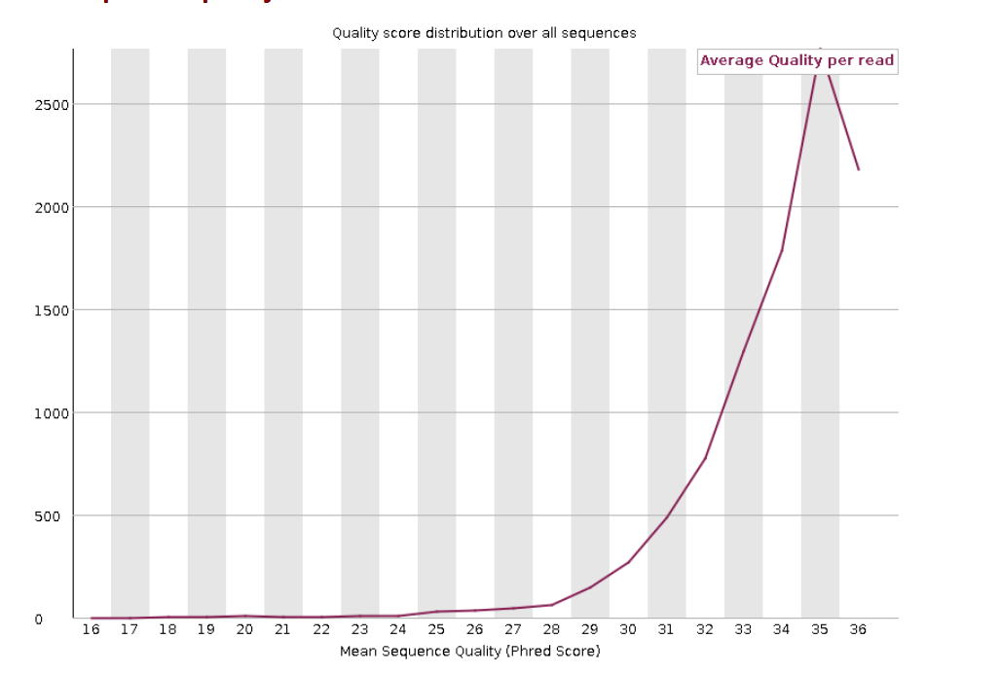
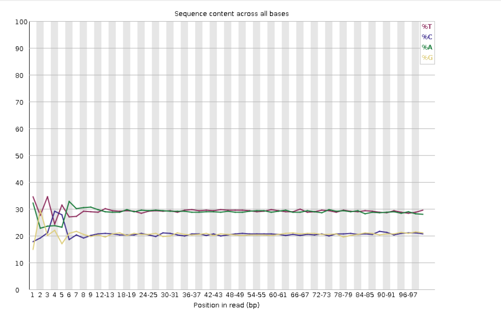
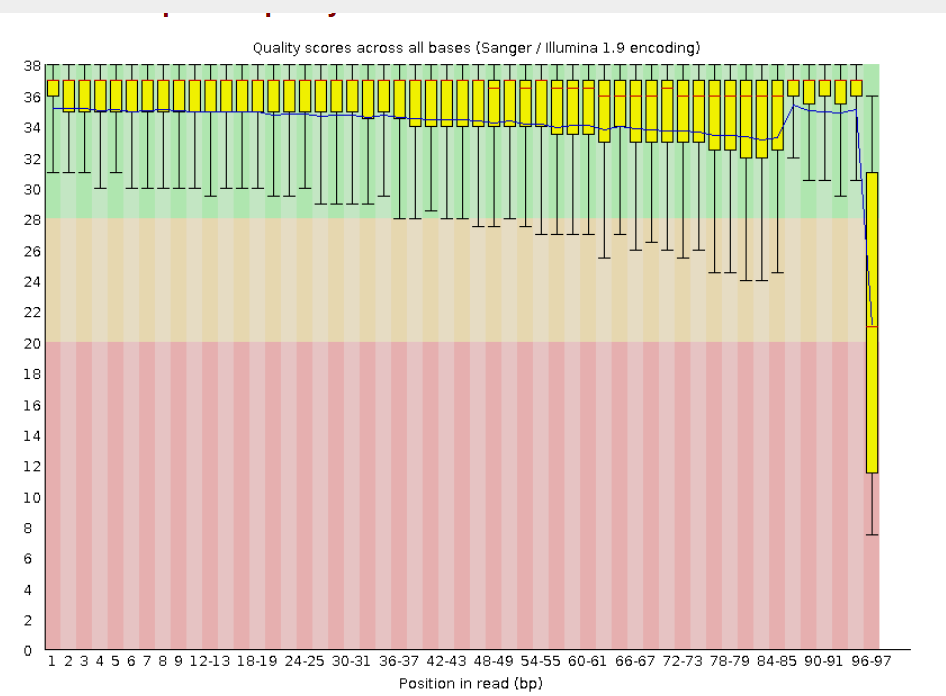
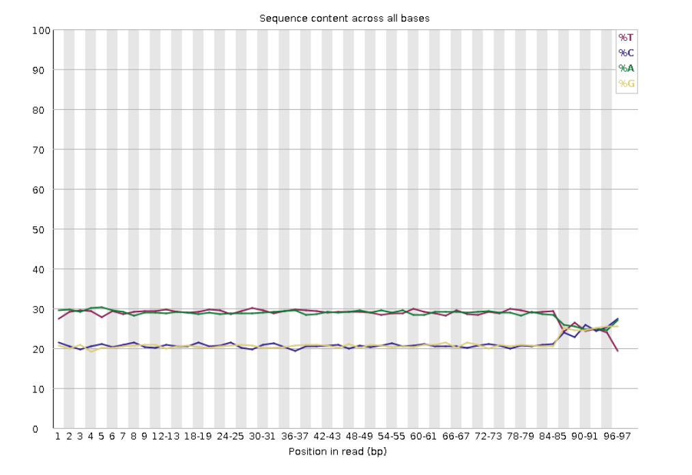

# Assigment 4: Tawny Owl Genome

* Note: Please make sure you use 
``` pixi add newt ```
to ensure the whiptail command works


## Background information 

As I expected, the Tawny Owl has a pretty sparse presence at 435 public genomes, almost all of which are Illumina sequenced. Still, this is more than I expected, especially for something that is basically the furthest from a model organism possible.


## Strix_aluco QC for ERR16930909			
This read is a little intresting since it comes from BGISEQ, a sequencing platform I really haven't heard of much. 


The quality score of the reads was surprisingly good and never dipped below ~24 across the 10000 reads. 



Weirdly enough, the paired read was much worse. 




The average quality for both reads was around 34. 


The first 8-9 reads show a weird amount of GC content variability, which might make this a good range to trim off. 



## fastp trim conditions

I chose to trim the 15 and final 30 bases of each read. I think this is a little excessive, but the reverse read was showing some oddness, especially towards the 90 bp mark. 

I also set the average quality of the read to be 25, which filtered out 984 of the 10000 reads. 

After trimming, the reads did look better, especially for the "reverse" read. 



Based on the remaining skew around 90 bp, though, I think I could have been even more dramatic with the 3' end trim. 



## How to use the makefile 

`download` will open up a dialog box into which you can paste your SRR number. Hitting enter will submit the number and download the first 10000 reads only.
 The species name will be taken from the metadata and used to rename the SRR number to the species name (e.g.E_coli_1).
 
  All downloaded FASTQs are placed in a separate folder. 

  `stats` will output the summary data, including read number and average length

  `fastq` will create an HTML document for each FASTQ file, nested within the parent FASTQ folder. 

  Zip files are removed. 

  `trim` removes the first 15 and last 30 bp from each read. Reads below the quality of 25 are removed. 
  Trimmed FASTQs are deposited in a seperate folder. 
  fastq analysis is automatically run and deposited into a nested folder. 

  `clean` will delete the FASTQ and trimmed folders


  <small> AI prompts used were: 
  I would like to make a command that asks you for a genome's SRR number in a dialog box, and then inputs that number into fastq dump. The fastq file will be saved to a directory called fastq. 

  can you change it to whiptail

  how can I make the "scientific_name" output from the bio command save as a variable which then becomes the FASTQ file's name

  how to fix the trim command <small>


