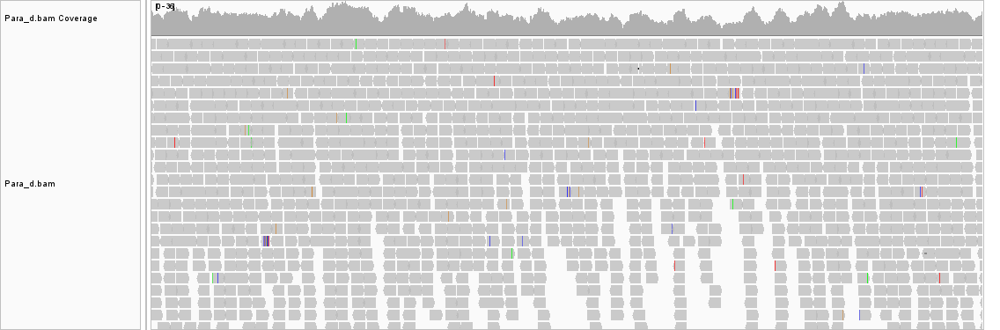
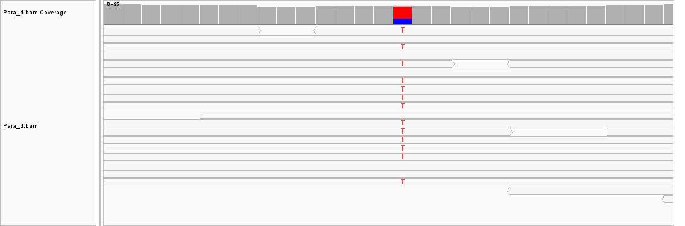
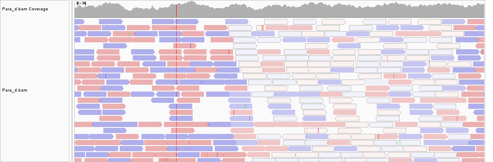

# Assignment 5: Generate a BAM file


Because my original genome was quite large, for this assignment I will be looking at <i>Paracoccus denitrificans</i>, a bacteria with nitrogen-reducing abilities. 

Its reference genome, which was sequenced in 2019 by Guangdong Ocean University, has the accession number: 

```GCF_004063735.1```

The genome size is 5.2 Mb, and contains 3 chromosomes. The reference assembly has 139x coverage and was sequenced via Illumina Hiseq. It seems pretty complete. 

The link to the genome fna download is [here](https://ftp.ncbi.nlm.nih.gov/genomes/all/GCF/004/063/735/GCF_004063735.1_ASM406373v1/GCF_004063735.1_ASM406373v1_genomic.fna.gz)

Copyable version: 
```https://ftp.ncbi.nlm.nih.gov/genomes/all/GCF/004/063/735/GCF_004063735.1_ASM406373v1/GCF_004063735.1_ASM406373v1_genomic.fna.gz```

## Using the Makefile

In an attempt to make the file more easily applicable for many genomes, I once again used whiptail to prompt the user for the SRR number, genome url, readable file name, and genome name. Unfortunately, because I made them part of the shell, they will run every time you run a command--the easiest flow will be to just run make all in one go. 

If using a command that doesn't need the variable directly, you can just enter through the prompts. It was fun trying to use the prompts, but I honestly wonder if it was more trouble than it was worth and I may get rid of it in the future. 


- make all: runs, fasta, fastq qc index and align
- fasta: downloads a reference genome from the url copied into the dialog box. The file will be named after your genome name
- fastq: downloads separated fastq files from a read number inputted into the dialog box. You will select the name of the generated files. Do not use spaces! 
- qc: Checks the fastq files for qc control
- trim and qc_trim: currently not included in the all command, but can be added in if using for runs with poorer quality 
- index: indexes the reference genome with bwa
- align: Aligns to the reference genome with BWA
- restart: removes FASTA, FASTQ, Trimmed, and BAM directories
- url: prints out a url that should get you to the SRR you inputed 


## Calculating Read Number to Achieve 10x Coverage

I'm planning to explore the project ```SRX32582901```. 

This is from an experiment with stationary growth conditions. It used llumina HiSeq 2500 with 100 bp reads.  

The specific run I'm using is: 

 ```SRR37705163```. 


Because I'm using a laptop, I can only reasonably align around ~1 million reads. I want to achieve at least 10x coverage

Thus, since: 

>>>Coverage = Number_reads * Length_reads / Gegnome_size >>>


>>> 10 = Number_reads * 100 / 5200000>>>

Thus, I can get 10x coverage with 520000 reads. 


The read quality seemed quite good across the full 100 bp and never dipped below 25. It was slightly odd within the first 15 or so bp, but it wasn't bad enough to really justify any trimming in the end.

## Alignment Results

According to the flagstat results, 99.72% of the reads aligned. This seems like a pretty good number to me. 


Total stats: 
- 1040239 + 0 in total (QC-passed reads + QC-failed reads)
- 1040000 + 0 primary
- 0 + 0 secondary
- 239 + 0 supplementary
- 0 + 0 duplicates
- 0 + 0 primary duplicates
- 1037290 + 0 mapped (99.72% : N/A)
- 1037051 + 0 primary mapped (99.72% : N/A)
- 1040000 + 0 paired in sequencing
- 520000 + 0 read1
- 520000 + 0 read2
- 1033812 + 0 properly paired (99.41% : N/A)
- 1036480 + 0 with itself and mate mapped
- 571 + 0 singletons (0.05% : N/A)
- 910 + 0 with mate mapped to a different chr
- 826 + 0 with mate mapped to a different chr (mapQ>=5) 

## Coverage and IGV Visualization 

Coverage was similar across all 3 chromosomes and would increase and decrease in waves. It wasn't consistent, but it did undulate consistently. However, there was adequate coverage throughout. 




I struggled to find any areas where there were any interesting variations compared to the reference genome. There were a couple of base pair changes, but they were generally few and far between. 


I wonder if this has anything to do with the fact the reference genome was recently sequenced, leaving little time for genetic drift, and it's not a particularly virulent bacteria that faces little "arms race" pressure to evolve. 

I did notice a couple regions where the reads were very pale. 



The best I could understand is that the alignments were shaded based on read quality, suggesting some areas were just prone to poor reads. 


