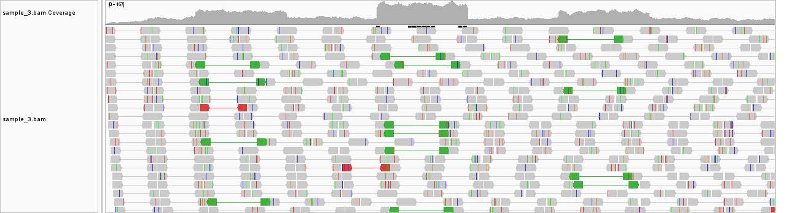
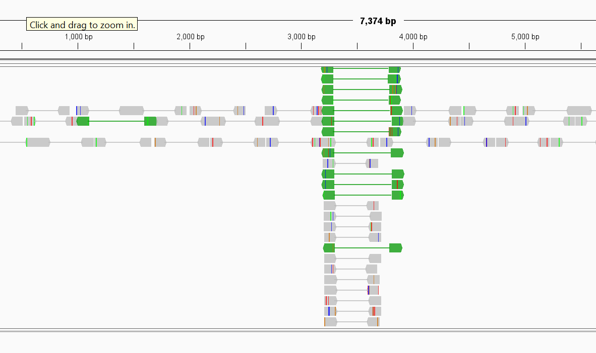
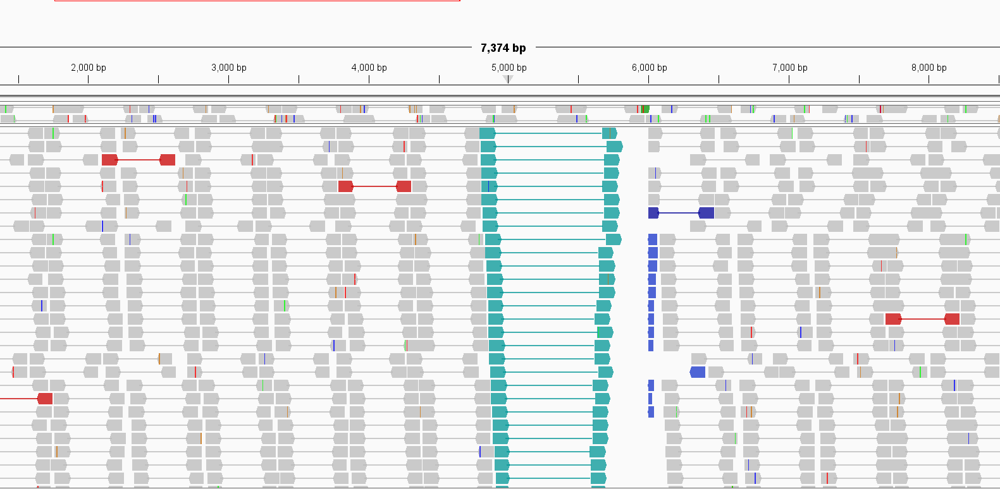
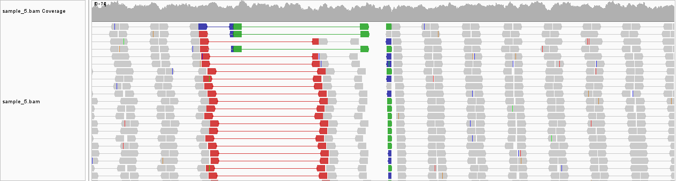

# Assignment 6: Interpreting alignments

## Sample 1
There are two insetions present, but both are small enough that they fit within the 100 bp reads. One occurs at approximately 14951 and is a single thymine insertion. There is a second insert of GTG at location 1,521. Again, it is small enough for a whole read to contain it. 

## Sample 2

The first thing I notice is that this sample is peppered with single bp changes throughout the genome, but there is rarely consenus across multiple reads. Only one or two reads will contain the same subsitution and the others for the same region will not, which makes me think these are not real changes, and instead problems with the sequencing quality. The GTG insert from sample 1 is still present, as is T insertion at 14951. There are several "real" subsitutions where the majority of reads show a consensus: one at position 1:736, which is a subsitution from T to G and another at 1:2,092, from T to A, and one at 1:2,438 (A to G). Some others include 1:14,501 (T to G). 
There was also low covereage (1-3) at the ends of the genome. Otherwise, there are no variations. 

## Sample 3 

I intially thought there were 3 translocations within the first 6kb, since there are many reads pointing towards each other. However, I noticed that the coverage for these regions nearly doubles, or in the case of the middle region, triples. We would not necessarily expect this if it was simply 1 piece of DNA changing location: we would expect to see the same number of reads, approximately. However, if there was a copy number variation with a dupltion, we might expect the same reads to get mapped onto the same reference multiple times, inflating the coverage. 

Therefore, I think there are tandem duplicatations from ~1000-2000 bp and 5000-6000 bp, and possibly a tripication at 3000-4000. 

When sorted by start base, the reads give an idea of how large each insertion is. The green reads start to map onto an adjacent duplication, making the reverse read flip. 

## Sample 4 

In this sample, we see a large number of reads facing the same direction between the 5000-6000 bp region. This suggests there was an inverstion at that point. Based on the area of flipped reads, the inversion itself may be from aroun 5500-6000 bp. 

## Sample 5

This one is a bit more tricky. There are both reads in red which, while still facing each other, are spaced too far apart and suggest an insertion of some kind. Most of the reads say an insertion of around 1497-1516. Because the "normal" grayed out reads are paired onto read lenghts of 500 bp, we can infer the insertion is around 1000bp.

 Right next to these, there are reads in green that are opposing each other, suggesting a translocation. Directly on the right of these regions, there are a number of oprphan reads. There is no change in coverage, though, so I'm assuming there is no duplication. 

I think it's possible there's both an insertion and translocation happening in this region, but it's tricky to parse out just want is happening in this mess.

